# Analysis : Effects of Regime changes on National Social Factors

## Authors
* Veeral jain (reev277)
* Rishabh Tripathi (rishabh1894)


## Description

August 2021, U.S. officially withdraws from Afghanistan after 20 years. Ever since U.S. announced its withdrawl policy from Afghanistan, and post its hasty withdrawl, there seems to be a common belief amongst the masses that, following the takeover by Taliban, there will be widespread anarchy and destruction of social compass of society. Only time will tell us how gruesome this takeover by taliban turns out to be. 
    
Through this project, we aim to verify the affects of such drastic regime changes which have occured in last 70 years in some of the countries of the world. 
    
We are referring to the data archive provided by the United Nations: Department of Economic and Social Affairs. 
### Data Source:

* [Data](https://population.un.org/wpp/Download/Standard)

### Summary of Regime changes

The datasets for the below 6 countries from different continents have been manually created. 
  * Iraq
  * Myanmar
  * Afghanistan
  * Libya
  * Germany
  * Venezuela

An exhaustive list of events which can be considered as turning points in their respective countries has been considered using BBC website as our reference and established timelines of historical events of the mentioned countries.

## Getting Started
1. Open the command terminal in the required folder and clone the repository using command
```
git clone https://github.com/reev277/2021Fall_finals.git
```
2. Open and run the file PR_PROJECT.ipynb

## Folder Structure

├── <strong>Data:</strong> Data files<br/>
├── <strong>Images:</strong> Images of plots for README file<br/>
├── <strong>functions.py:</strong> Functions to perform the desired analysis<br/>
├── <strong>PR_PROJECT.ipynb:</strong> Analysis and Hypotheses testing<br/>
└── <strong>README.md</strong>

## Analysis:
### Hypothesis 1
Colonel Gaddafi, who was widely considered as a cruel dictator, might have impacted the mortality of the country. Hence, below is the first hypothesis.
#### We expect the adult mortality to decrease post the killing of Col Gaddafi in Libya in 2011.
Mortality all gender means number of deaths over a given period. It is expressed in thousands.
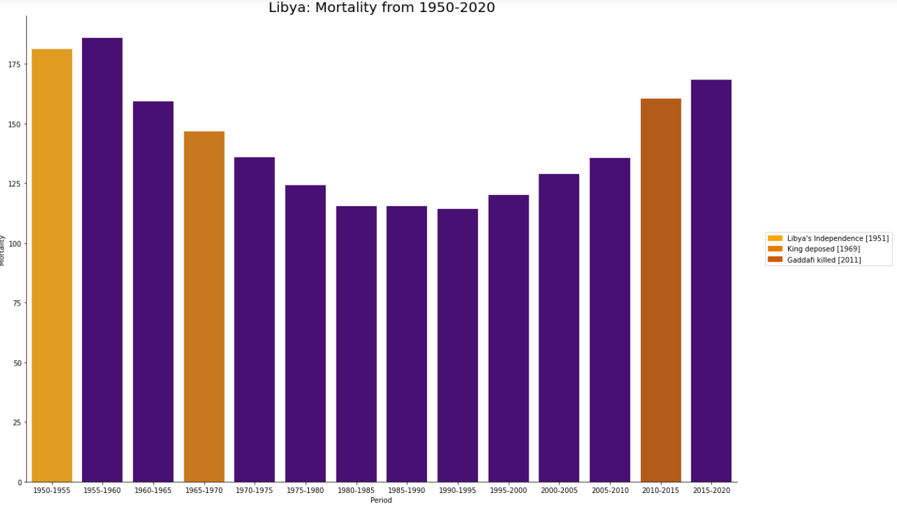

The above plot shows the mortality variation with the period of time for Libya and highlighted colors are the major events mentioned before. There is a slight rise in mortality post independence. it then started decreasing and suprisingly, kept decreasing even after Gaddafi came into power. Then the mortality started increasing from year 1995-2000 and kept increasing till 2015-2020
#### The plot depicts that there is 24.23% rise in the mortality post the killing of Gaddafi which rejects our hypothesis which expects a fall in the same.

### Hypothesis 2
According to us, people will be less motivated to migrate from a country where there is a higher life expectancy. Hence, below is the second hypothesis.
#### In most of the cases with an increase in life-expectancy, the net migration decreases i.e. life-expectancy and net migration are negatively correlated
Correlating Life Expectancy with Net Migration
* Net Migration is calculated as the number of IMMIGRANTS minus the number of EMIGRANTS. Expressed in thousands
* Life Expectancy is the the average number of years of life of individuals who would be subject to the mortality rates of a given period. It is expressed as years.
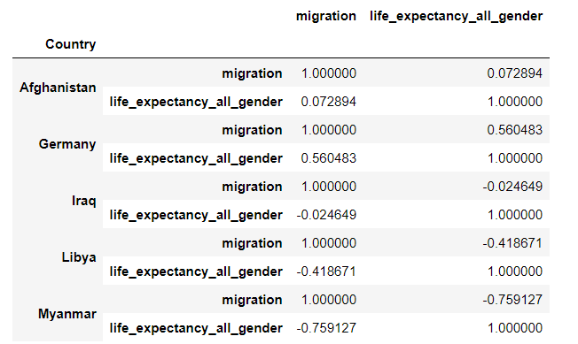
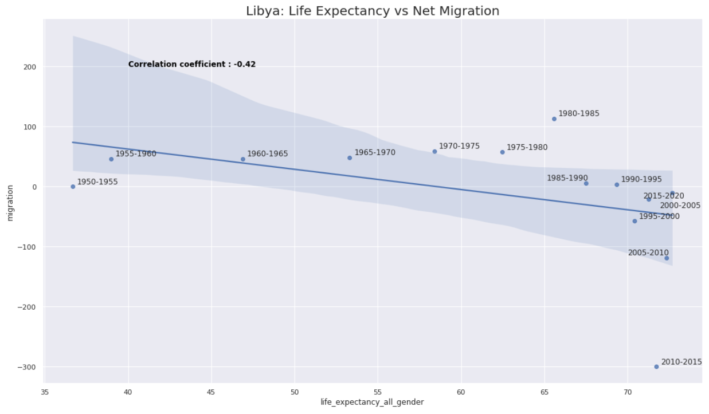
The correlation between the migration and life expectancy of all gender is negatively correlated with a coefficient of -0.42. The points shows the period range for the respective relation. There is a steep drop in the relation during the period 2010-2015 which also was the period when Gaddafi was killed.
As the expectancy increases, the migration seems to have more negative value, which means people are moving out of the country. This is a surprising observation

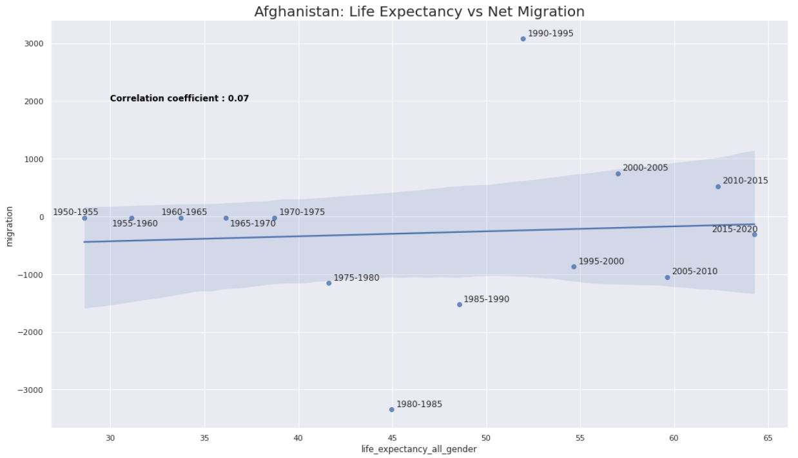
The correlation between the migration and life expectancy of all gender is positively correlated with a small coefficient of 0.07 for Afghanistan. For the initial few years, the net migration is near to 0. One possible reason can be due to the data not being recorded or people actually didn't migrate at all.
There is a steep drop in the migration during the period 1980-1985 which also was the period when Soviet Union had invaded the country. There was civil war in the period of 1990-1995 where we observed an abrupt rise in the miration when compared with the life expectancy.

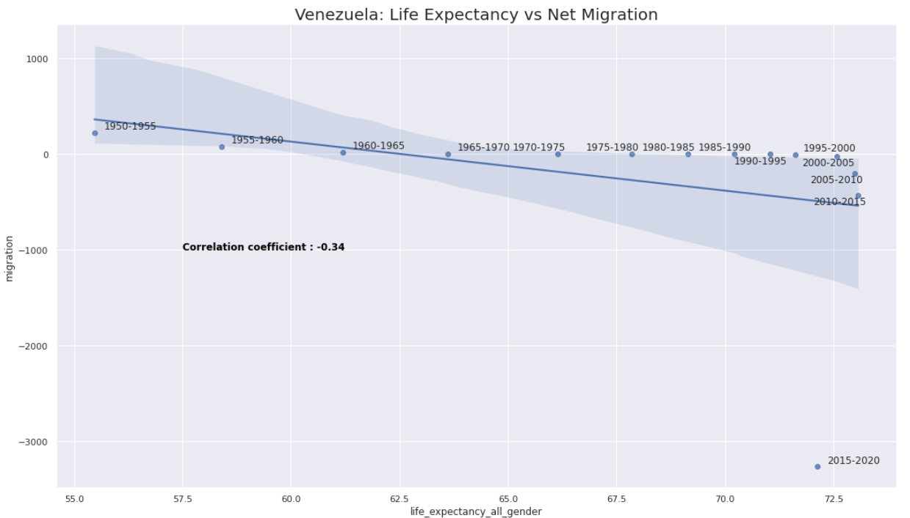
The correlation between the migration and life expectancy of all gender is negatively correlated with a coefficient of -0.34 for Venezuela. The initial values are somewhat near to 0, which suggests that the data was not recorded or there is not migration from or to the country. There is strong negative correlation towards the end of the period.

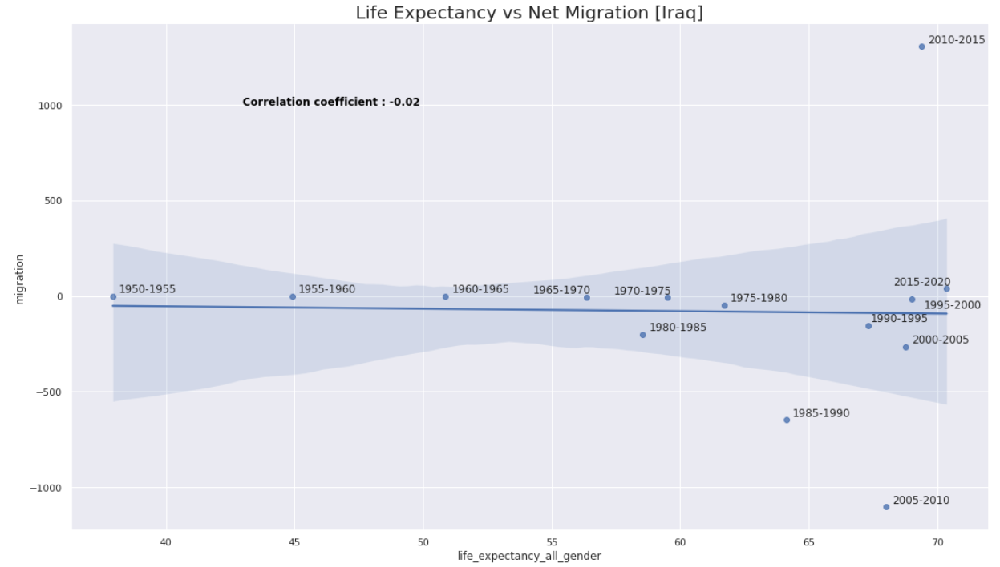
We can observe here that initial migration values are near to 0 which suggests that the data is not recorded at all in the initial years. The correlation coefficient is -0.02 which is slightly less than 0. We can say that for Iraq, based on the data we have, life expectancy and migration are not significantly correlated.

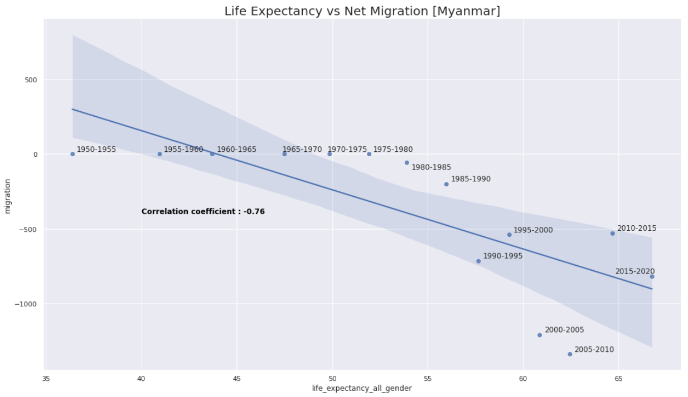
Similar to the above scenarios, the data is not significant before 1975-1980. Post that period, we can observe a strong negative correlation between the life expectancy and migration with an overall correlation coefficient of -0.76

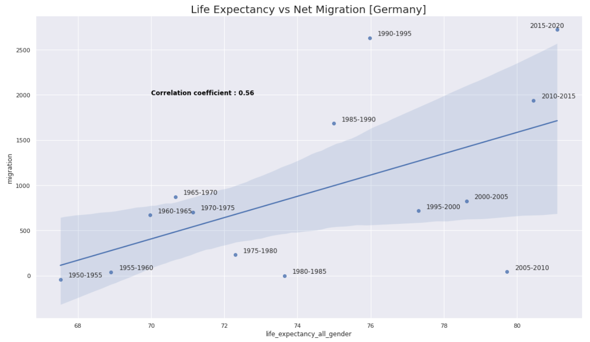
For Germany, we observe a positive correlation cofficient of 0.56. We can also observe that the migration is mostly positive which means that there are more immigrants than emigrants.

#### Observation

From the above analysis, we can observe that most of the countries had a negative correlation between life expectancy and migration. This means that even after the increase in life expectancy, there is no increase in the incoming population. This might depend of different factors which are not considered here for the variable.

We can notice that Germany had a good positive relation between life expectancy and migration which was the only case where our hypothesis satisfied. Apart from that, we can not prove our hypothesis based on the given data and plots which means, the hypothesis is rejected. One thing to notice is that, there were few countries where the migration data were nearly 0 during initial period and that might have impacted the outcome. Also, Germany is ony the countries counted in the developed nations where as others are under-developed or developing nations. This along with other unknown factors might have impacted the correlation as well.

### Hypothesis 3
Since Angela Merkel was the First Woman Chancellor of Germany elected in 2005, it is a reasonable assumption that it would have led to a society which is oriented towards the interest of women. Keeping that in mind, we expect the women in Germany to flourish and hence, below is the third hypothesis.

#### Post the election of Angela Merkel as the first woman Chancellor of Germany in 2005, the female mortality rate before age 60 has decreased along with it being lower than the male mortality rate before age 60, post Angela Merkel's election.
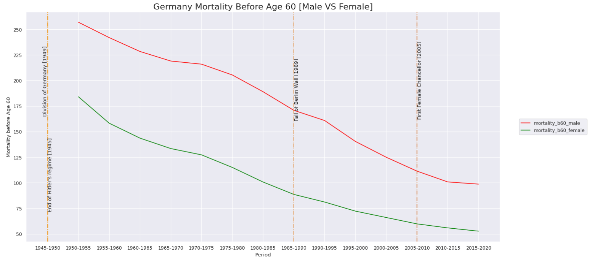

#### Observations:
In the above visuals, we can observe that there is continuous decrease in the mortality before 60 for both males and females. The vertical dashed lines show the regime changes in Germany. While pondering upon the data, we can observe that after the election of Angela Merkel as the first Chancellor, the female mortality under 60 has decreased. Also we can notice from the graph that the difference between the male and female mortality under 60 has decreased.
To understand more about the data and the comparison for the hypothesis, below is a table which depicts the percentage increase/decrease in the pre/post event.

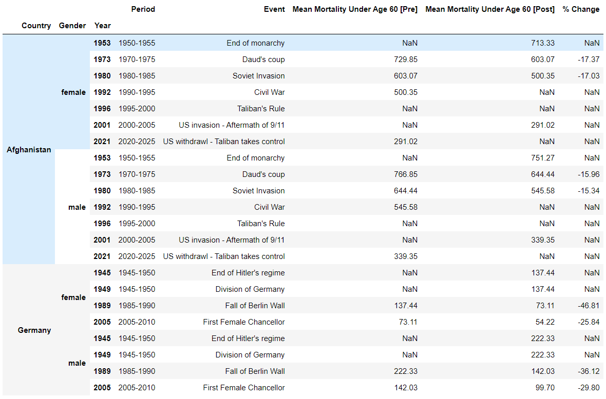

#### Observations:
The above table helps us in getting a better insights of how the mortality rate changes within two events. This can be calculated for any country and social factor due to the dynamic ability of the function. As we can observe, there is 25.84% decrease in the female mortality under 60 after the appointment of first female Chancellor
The above analysis shows that the hypothesis can be accepted as after Angela Merkel was elected, there is decrease in female mortality under 60 and along with that, there is decrease in the difference of the mortality as well between male and female.

Note : The NaN values which are shown are due to the fact that no data exists in our dataframe for values before the corresponding period.

### Hypothesis 4 
It is a common notion that women in advanced societies bear child in a much older age than the women in underdeveloped or developing countries. Hence, below is the final hypothesis.

#### We expect the mean age of childbearing to be higher in well-developed societies. Hence, the mean age of childbearing must have increased post the fall of the Berlin Wall in Germany in 1989. While in all the subsequent events which swayed away from democratic systems, and those that occurred in under-developed or developing countries, the mean age of childbearing remained constant or decreased.

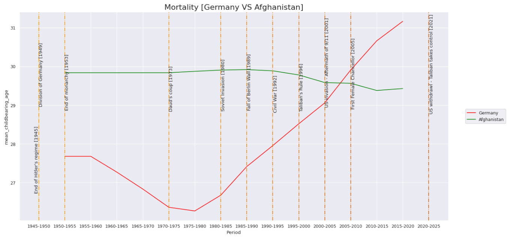
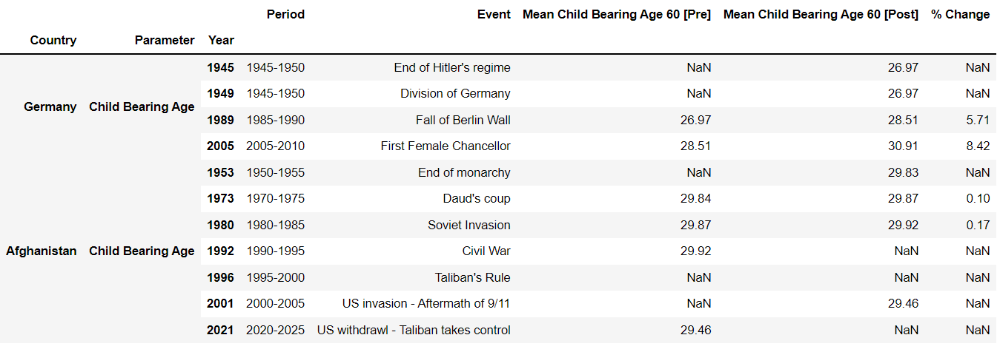

#### Observations:
* As expected, the child bearing age of Germany increased whereas it decreased for Afghanistan over the span of years but it started with a constant value for around 3 decades for Afghanistan
* The value for Germany reduced in the initial phase then started increasing as expected.
* Thus, we can accept our hypothesis in this case.

Note : The NaNs being displayed for pre and post values in the aforementioned and subsequent dataframes for periods which are not at the extremes, are due to the fact that there are consecutive periods which have events present. Hence, in this case the statistics relating to a particular event are not being considered in either pre or post cases. Instead they are only being used as reference.


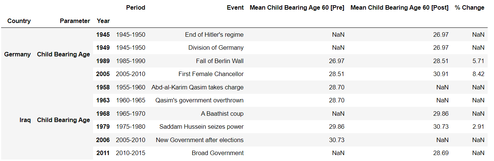

#### Observations
* The graph for Iraq had certain amount of change. The Child bearning mean age increased till 1985-1990 but then started decreasing with a steep slope and returns back somewhere near to where it started 70 years ago
* The slope decreases for Iraq towards the end.
* Even though elections took place in 2006, the mean child bearing age yet kept decreasing. 
* Thus, we can say our hypothesis can be rejected in this case.


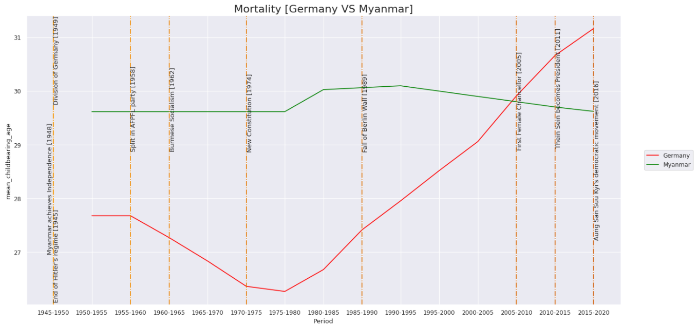
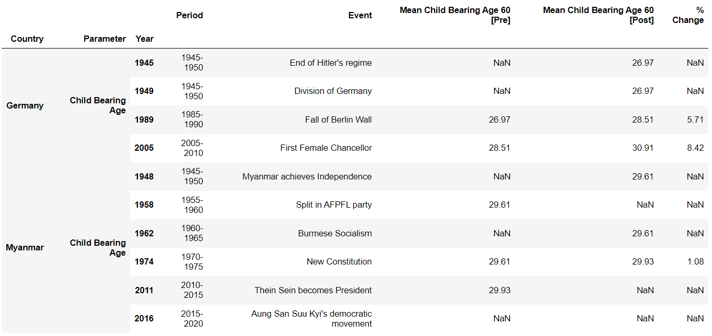


#### Observations
* In case of Myanmar, the child bearing age started increasing with Germany in period 1975-1980
* Then towards the recent years, the bearing age for Myanmar has reduced.
* The bearing age for Germany in start of the 1950s was less than Myanmar, but it later turns out to more towards the end of 2020
* Thus, we can not clearly reject the hyothesis here as there is no significant change for Myanmar.


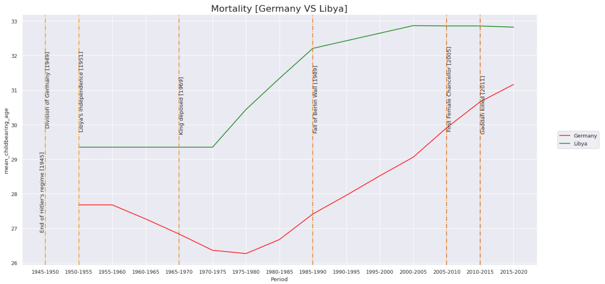
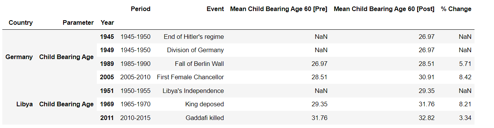


#### Observations
* In case of Libya, the trend is totally opposite to our expectations.
* The child bearing age is more than Germany from start to end.
* There is a slight decrease in the child bearing age for Libya towards the end of period 2015-2020
* Thus, we can reject the hypothesis in this case.

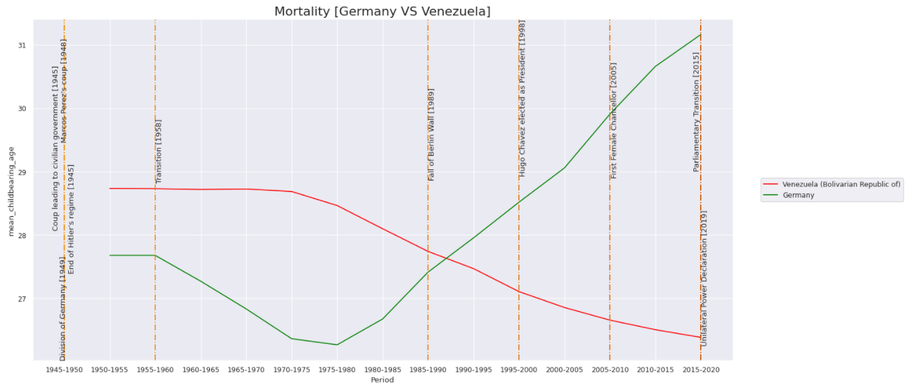
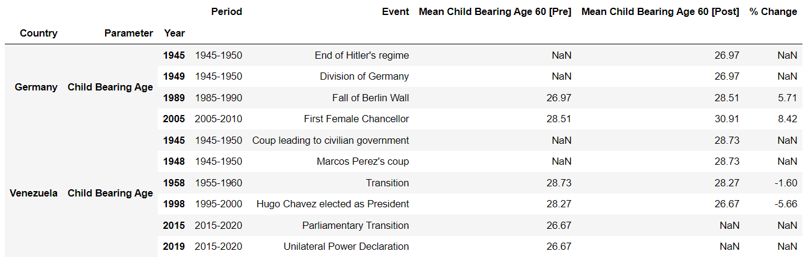


#### Observations
* The Child bearing age of Venezuela has decreased drastically over the span of time.
* Thus we can say that our hypothesis is true in this scenario.

## Conclusion

By this analysis we come to the conclusion that many of our preconceived notions about the soical factors of various countries and regimes across the world have been debunked. Hence a closer look needs to be taken as to what are the actions taken under certain regimes which are causing the observed effects on the various social parameters studied above.


## References:
* https://population.un.org/wpp/Download/Standard
* https://www.bbc.com/news/world-middle-east-14546763
* https://www.bbc.com/news/world-south-asia-12024253
* https://www.bbc.com/news/world-asia-pacific-12992883
* https://www.bbc.com/news/world-latin-america-19652436
* https://www.bbc.com/news/world-europe-17301646
* https://www.bbc.co.uk/news/world-africa-13755445
